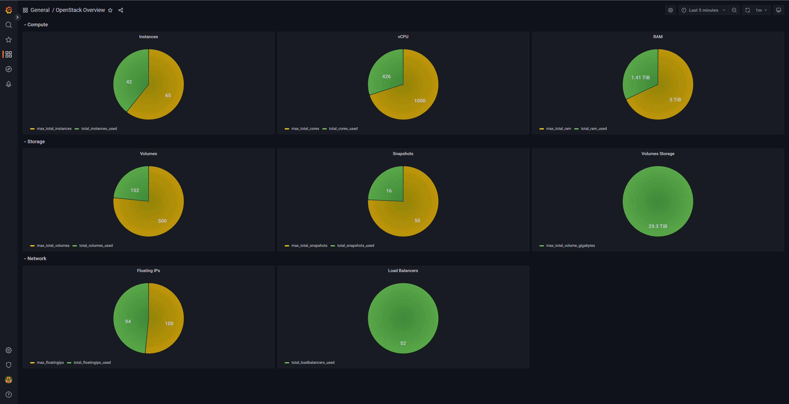
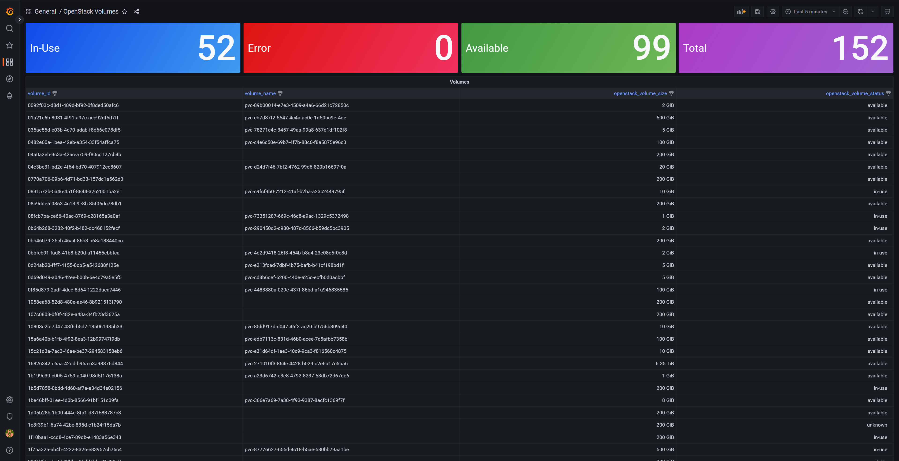
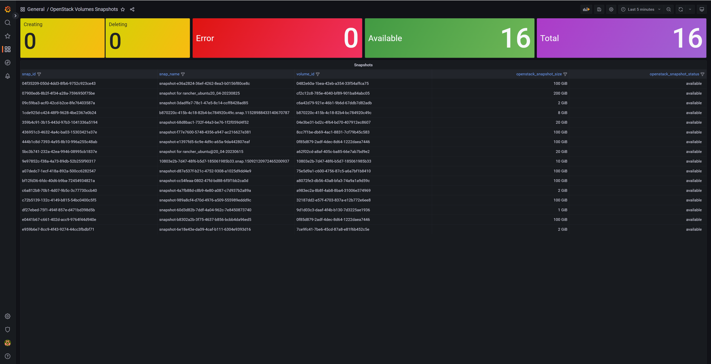

# OpenStack Tenant Exporter

This chart installs the OpenStack Tenant Exporter, a Prometheus exporter that collects metrics about OpenStack tenants. This exporter uses the `gophercloud` library to interact with the OpenStack API.

## Requirements

- [Kube Prometheus Stack](https://github.com/prometheus-operator/kube-prometheus)
- Cloud Config Secret (below)

The Helm Charts needs a secret cloud-config. In case you don't have it. You can create as the example below or pass in values.yaml file. To use the Helm Chart to create it. Enable first secret.create=true and fill secret.cloudConfig with your own info

``` yaml
apiVersion: v1
kind: Secret
metadata:
  name: cloud-config
  namespace: kube-system
type: Opaque
stringData:
  clouds.yaml: |
      clouds:
        default:
          region_name: regionOne
          auth:
            username: username
            password: password
            project_id: project_id
            project_domain_name: 'default'
            user_domain_name: 'default'
            auth_url: 'https://<mycloud>:5000/v3'
          verify: false
```

## Install Using Helm

``` bash
helm upgrade --install openstack-tenant-exporter oci://registry-1.docker.io/brocolis/openstack-tenant-exporter -n kube-system
```

## OpenStack Metrics

- openstack_max_total_instances
- openstack_total_instances_used
- openstack_max_total_cores
- openstack_total_cores_used
- openstack_max_total_ram
- openstack_total_ram_used
- openstack_max_total_volumes
- openstack_total_volumes_used
- openstack_max_total_snapshots
- openstack_total_snapshots_used
- openstack_max_total_volume_gigabytes
- openstack_total_volume_gigabytes_used
- openstack_max_loadbalancers
- openstack_total_loadbalancers_used
- openstack_max_floatingips
- openstack_total_floatingips_used
- openstack_volume_size
- openstack_volume_status
- openstack_snapshot_size
- openstack_snapshot_status


## Dashboards Examples




